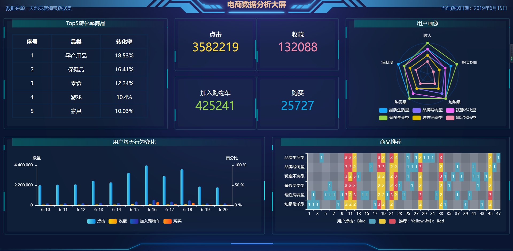
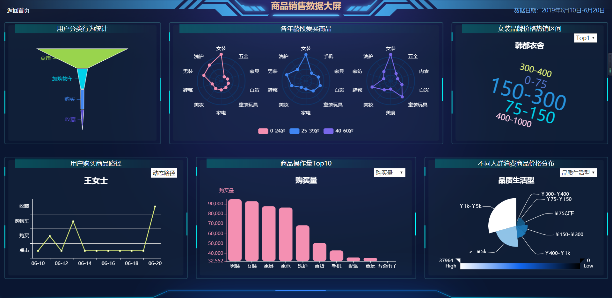
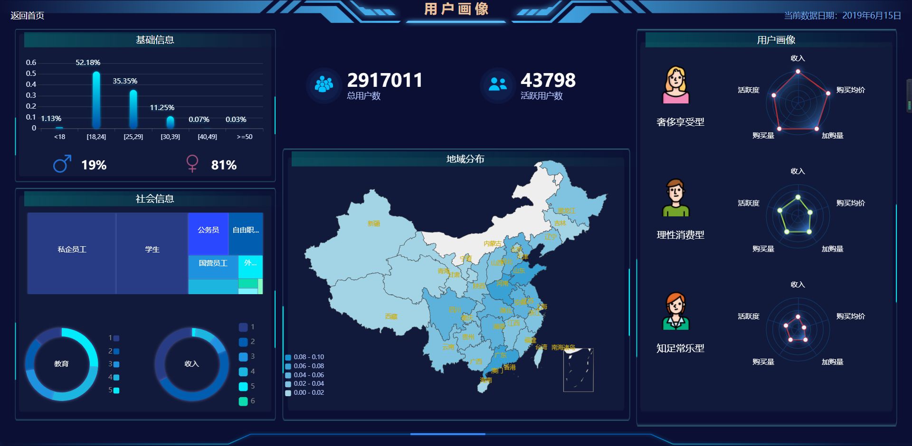

# E-commerce-data-visualization
## 电商数据可视化
### 概述
本项目的电商数据可视化系统主要为电商商户提供商品销售数据分析、用户相关数据分析方面的可视化大屏展示。

本系统选用的是天池平台的CIKM 2019 EComm AI用户行为预测数据集，包含了阿里电商平台2019年6月10日-2019年6月20日期间的部分用户信息(100万条)、商品信息(1000万条)、用户行为信息(2亿条)。本系统中的所有数据展示都在此范围内。且由于该数据集已脱敏，因此没有id对应的真实含义信息，相关Map映射是本组人员根据网络资料估计而来。

本系统包含两个子系统：可视化系统和数据处理系统。可视化系统是一个网站，由4个网页构成，分别是首页大屏、商品大屏、用户大屏、动态路径大屏。数据处理系统包含算法模块和数据处理模块，主要用来生成可视化系统需要的输入数据。用户可以操作的主要是可视化系统，将该网站在本地运行后，可以浏览多个大屏，获取自己想要的信息。

### 相关技术与工具
- 数据来源：[天池CIKM 2019 EComm AI数据集](https://tianchi.aliyun.com/competition/entrance/231719/introduction?spm=5176.12281957.1004.9.38b024486FnPqi)	
- 原型工具：FineBI
- 前端：HTML/CSS/javaScript/ECharts/jQuery
- 后端：Flask+Pycharm
- 数据分析：Python3/Pandas/jupyter notebook/MySQL

### 效果展示
#### 首页大屏

#### 商品大屏

#### 用户大屏

#### 动态路径大屏

### 文件目录
- app文件夹是网站,manage.py是网站启动脚本
	- templates里面是html文件
	- static里是js、css、json文件
- data_system文件夹里是数据处理系统和算法文件
	- data_process是面向对象方式的数据处理代码
	- algorithm里是推荐算法、聚类算法的代码 
- docs文件里是计划、需求、设计文档
### 可视化系统说明
（1）使用如下安装命令从Github网站下载本项目：
```shell
git clone https://github.com/SuperVivian/E-commerce-data-visualization.git
```
（2）使用如下命令从requirements.txt安装依赖
```shell
pip install -r requirements.txt
```
（3）使用如下命令运行该项目：
```
python manage.py
```
（4）在浏览器中打开如下网址：
```
http://127.0.0.1:5000/
```
### 数据处理系统说明
（1）	根据data_system/Jupyter中pandas处理脚本对于原始数据进行进行筛选，剪切，映射等操作，得到初步的数据集.

（2）	根据data_system/data_process中mysql_data.sql脚本建立好MySQL中的数据库，并导入数据集

（3）	下载data_system/data_process 的数据处理系统，根据本地配置改写配置文档，然后运行main.py文件，生成数据结果。如下命令运行数据系统。
```
python data_system/data_process/main.py
```
（4）	获取在data_system/data_process/data中的txt文件形式的数据结果。


