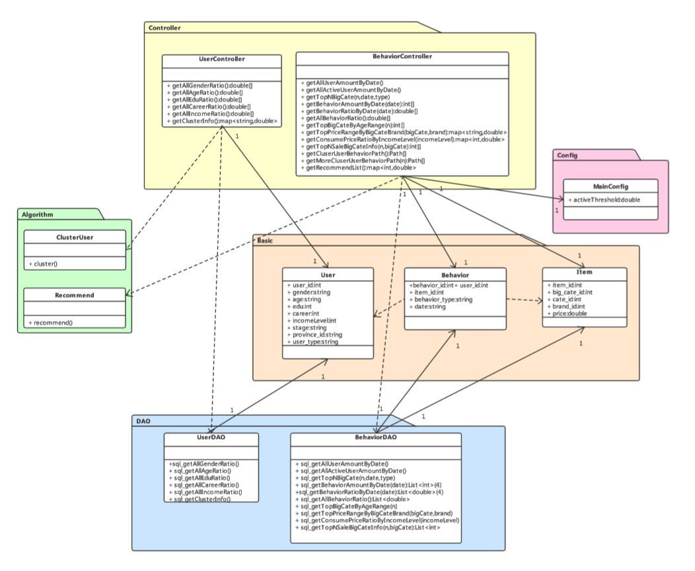

### 项目介绍

Python实现的数据处理系统，主要利用，Pandas 和 Mysql ，实现对电商数据集的数据提取。为了更好的架构，参考WEB开发的架构模式，实现前后端分离以及后端，DAO层，Service层，Control层的划分。

#### 数据集

- train.csv, 3700万条记录 
- items.csv，1000万条记录 
- user.csv, 16万记录 

#### 组织结构

```
├── Jupyter -- Pandas处理原始数据集
│		├── Data_clean -- 原始数据的清洗
│		└── Data_partition -- 数据集划分
└── data_process -- 数据处理系统
		 ├── Basic -- 实体类
 		 ├── Control -- 数据交互层
 		 ├── DAO -- 数据库交互层
 		 ├── data -- 处理结果
 		 ├── Service -- 业务逻辑层
 		 ├── config.ini -- 配置文件
 		 ├── mysql_data.sql --数据库文件
 		 └── main.py -- 启动文件
```


#### 类图：



### 项目运行

一次完整的数据处理，在2核4G内存的系统大概花费时间为32分钟。
